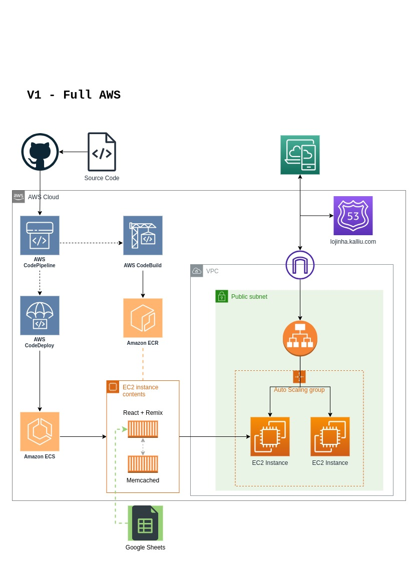
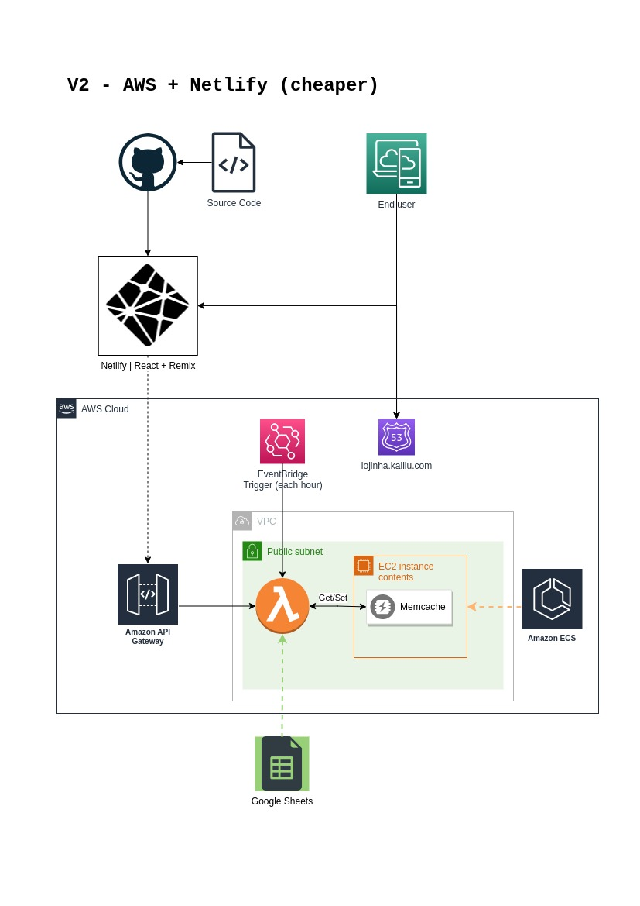

# Lojinha Web

**[🔗 Check it out!](https://lojinha.kalliu.com/)**

(This hosted version won't have the cache layer, due to the costs of hosting it on AWS)

- [Lojinha Web](#lojinha-web)
  - [About](#about)
  - [Solution: The new cloud architecture](#solution-the-new-cloud-architecture)
    - [V1 - Full AWS architecture](#v1---full-aws-architecture)
    - [V2 - Netlify + AWS Lambda (cheaper solution)](#v2---netlify--aws-lambda-cheaper-solution)
  - [Technologies and Libraries](#technologies-and-libraries)
  - [What is Lojinha?](#lojinha)

## About

This project is a more updated version of the [current Lojinha official website](https://lojinhaimportados.com.br/lista/), where I better showcase my most recent learnings in Front End development, implement best practices and open it to a public repository with the authorization of the client.

👉 I probably won't implement everything the original project has, because I'm focusing on build my portfolio with the majority of the technologies I'm studying, but I'll try to implement the most important features.

When I first develop this freelance project on **Jan/2020**, the client wanted a new website for their store, which would be used by their customers to see the products available in the store. They wanted a project with no recurrent costs (such as a CMS or a database), so I developed a script to read their Google Sheets spreadsheet and generate a JSON file with the products data, which would be used by the website. So yes, Google Sheets is my database and API.

Now I see that the users had a long repeated initial request time, so I decided to rebuild this application with an architecture that uses server-side rendering and caching. To achieve this, I'm using Remix with Memcached, hosted on AWS.

## Solution: The new cloud architecture

### V1 - Full AWS architecture

To this new version, I'm using Remix with Memcached, hosted on AWS. Although this project doesn't need a high availability solution, I'm using AWS because I'm studying for the AWS Certification, so I'm using this project as a playground.

Probably this would not be the best solution for this project, because the client still doesn't want to pay for a hosting solution and this solution has EC2, Load Balancer and Pipeline costs.

### V2 - Netlify + AWS Lambda (cheaper solution)

This version has a mixed solution, but uses AWS at the minimum, so it's cheaper. I'm using Netlify to host the website and AWS Lambda to be an interface between the database and the cache layer.

In addition, the EventBridge trigger is used to update the cache layer when the database is updated, so the website never has to wait the database response again and would only communicate with the cache layer.

## Technologies and Libraries

- [TypeScript](https://www.typescriptlang.org/): Language
- [React](https://react.dev/): JavaScript Framework
- [Remix](https://remix.run/): Server-Side Rendering framework
- [Netlify](https://www.netlify.com/): Hosting solution
- [Amazon Web Services (AWS)](aws.amazon.com): Cloud solution
- [Memcached](https://memcached.org/): Cache solution
- [Material UI](https://mui.com/material-ui/getting-started/): Component library
- [Zod](https://zod.dev/): TypeScript validation library

## Lojinha

"Lojinha Importados" is a Brazilian store focused on general electronic products, selling its items in a physical store and on marketplaces such as MercadoLivre and its own virtual store.
